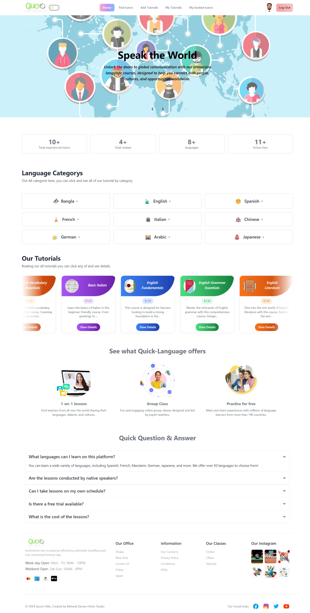
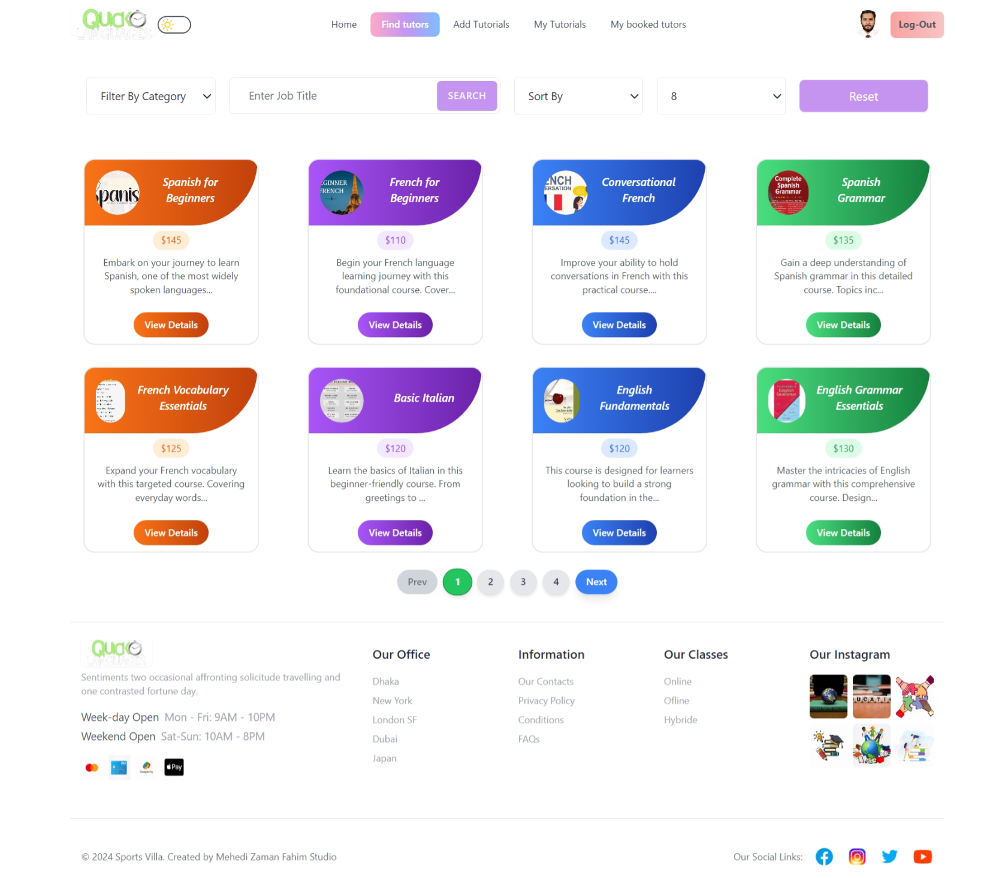
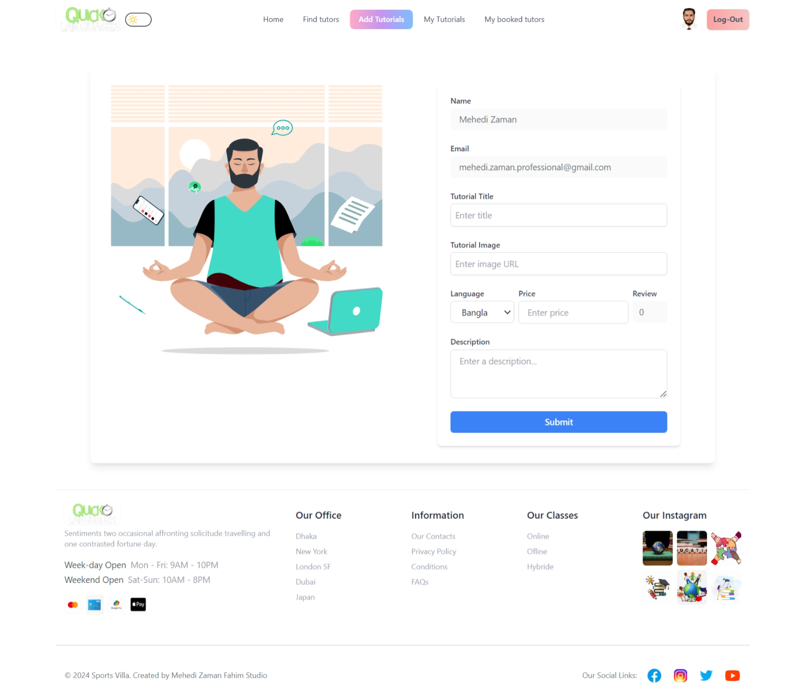
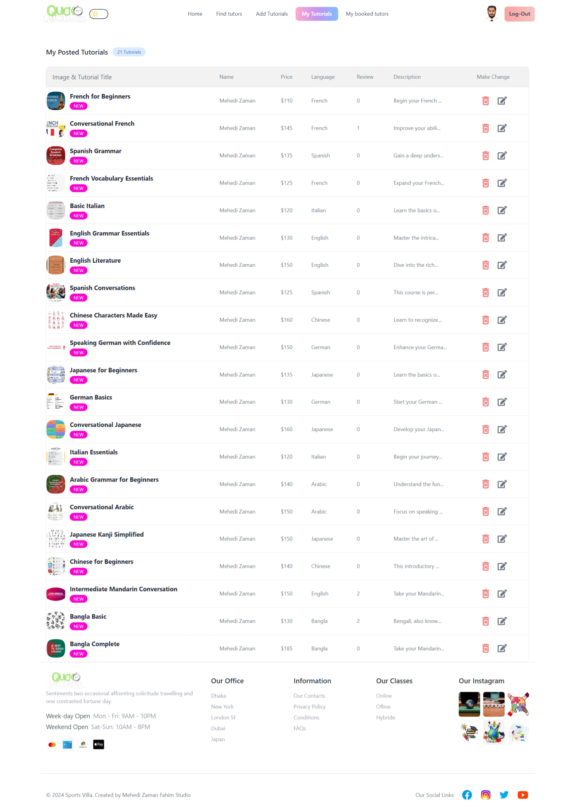
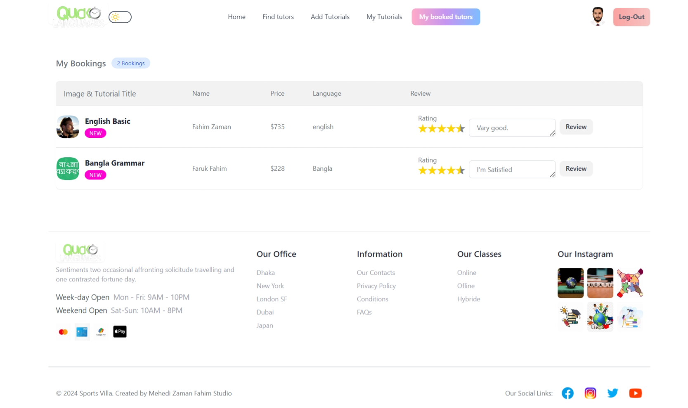
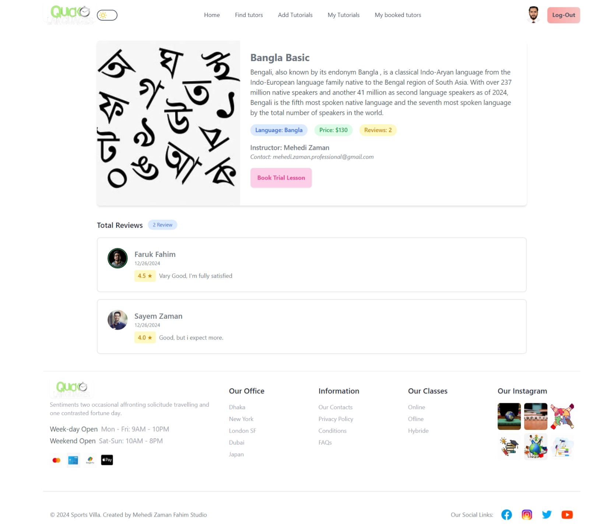

# Project Name: Quick-Languages (Quick-Languages Website).

## Short Description:

This is a single page web application. This project is an Online Languages Tutor Booking Platform, designed to connect users with tutors across various languages and subjects. It simplifies the process of finding, reviewing, and booking tutors through an interactive and user-friendly interface.

## List of React Fundamental concepts used in the project

1. **JSX (JavaScript XML)**
2. **Components**
3. **Props**
4. **State**
5. **Event Handling**
6. **Conditional Rendering**
7. **useEffect Hook**
8. **CReact Router (Routing)**
9. **Conditional Rendering**
10. **Express**
11. **MongoDb**

## List of npm packge

1. **animate.css**
2. **firebase**
3. **moment**
4. **react-countdown**
5. **react-fast-marquee**
6. **react-headroom**
7. **react-responsive-carousel**
8. **react-scroll-to-top**
9. **react-toastify**
10. **swiper**
11. **react-icons**
12. **recharts**
13. **react-helmet**
14. **React Awesome Reveal**
15. **jwt**
16. **axios**
17. **asionsecure**

## Clone the Repository
**git clone [https://github.com/MehediZ07/Medicine-Hub-with-MERN-Stripe.git]**

## Install Dependencies
**npm install**

## Set Up Firebase Configuration
**Create a .env file and add your Firebase API keys.**

## Start the Development Server
**npm run dev**

## Live Link Firebase deploy

[Quick-Languages Web App](https://quick-language.web.app/).

### Preview

